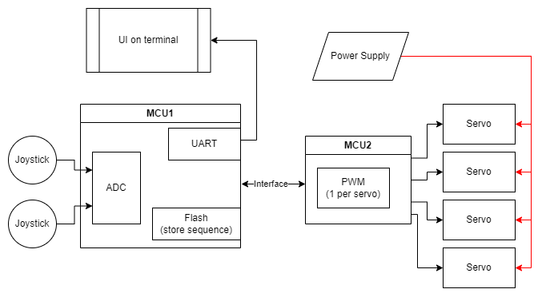

# adaptable-joint-control
A standardized interface to control any joint using any type of input for control.

## Introduction

The goal of this project is to create an adaptable joint controller that can be driven through multiple different input sources. This would make plug-n-play the integration of systems that can (1) drive joints to systems that can (2) provide joint control data. 

A list of examples of systems that can provide joint control data:
1. Computer vision hand tracking
2. Haptic gloves
3. Hand simulation
4. Myoelectric sensors

These systems will then be able to connect to systems that drive joints and control those joints seamlessly.

## Applications

This project was made with joints of the hand in mind (for arm prosthetic control), but it can easily be adapted to any system with joints.

## Standadized Joint Control Interface

The secret to making this project work is a standard Joint Control Interface (JCI).

This interface is implemented using a custom protocol for transferring joint data.

This interface also assumes a full-duplex connection between the two sides of the interface. Otherwise, considerations must be made.

### Streamer and Listener

The protocol works on the basis of data senders called Streamers and data receivers called Listeners.

A board can be both a Streamer AND a Listener. For example, a board that drives joints may be listening for data, but it might also be streaming back the current state of its joints based on sensor values.

### C-flow

A C-flow is when a Streamer and a Listener agrees on the header configuration such that the Streamer can start sending C-type packets, which contain no header information but only data. The C comes from the fact that the flow is Continuous.

A C-flow is only interrupted when the Streamer decides to send a new request to enter a new C-flow configuration OR if the Listener notifies the Streamer to stop the C-flow (either because it receives C-flow packet but doesn't know the C-flow configuration OR if it wants to arbitrarily cancel the C-flow).

A C-flow Streamer can send any type of packet to the Listener as long as the packe t is not a request to enter a new C-flow, in which case the current C-flow is canceled.

### Packet Types

The protocol has 4 packets types.

#### S type

#### C Type

#### R type

#### A type

## Repository Structure

1. examples : folder containing example projects using the standardized JCI.
2. images : figures used in the README
3. src : contains the source code for the standardized JCI.

## Examples

### 1-joystick-control

This example uses two boards:

1. MCU1 is the Servo Driver Unit (SDU) and it is responsible for receiving the control data, parsing it, and driving the servos accordingly.

2. MCU2 is the Control and Telemetry Unit (CTU) and it is responsible for receiving sensor data (in this case, the joysticks) and formatting the sensor data to a standard data format to drive the servos. The standard data formatting is what makes it adaptable to any control source. This board is also used to store a sequence on control data in its Flash for later playback. The CTU also uses its UART interface to provide a command-line interface (CLI) and real-time telemetry on the serial terminal of a host computer.
The two boards communicate together through an inter-face which will either be Bluetooth or UART, depending on the time available after implementing the other features.

The high-level architecture can be seen below:

## Contributors

The list of contributors
### Standard Joint Control Interface
-Jacoby Roy

### Examples

#### 1-joystick-control
* Theodore Glavas
* Nardo Edward Jean Gilles
* Jacoby Roy
* Yongde Yu

## Licensing

The licensing of each file is indicated inside them. The STM32 files are licensed under the STM32 license. In the case where the file doesn't contain any license, it is licensed under the repository license.

